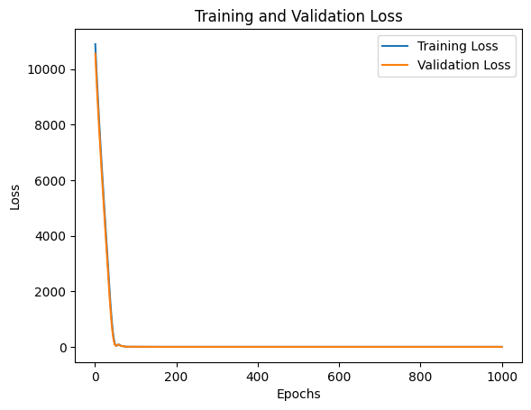
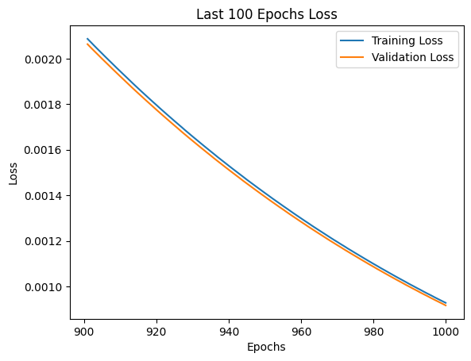

In this post, I'm going to describe building a simple neural network using PyTorch that learns to add two numbers.

### Data Generation

First, I'll define a method that generates the data. This method returns two tensors. The first tensor, `x`, is the input to the model, and the second tensor, `y`, is the expected output (the sum of the pairs of numbers).

```python
def generate_data(num_samples=1000):
    x = torch.randint(0, 100, (num_samples, 2), dtype=torch.float32)
    y = torch.sum(x, dim=1, keepdim=True)
    return x, y
```
<!--truncate-->

### Defining the Model

Next, I'll define a simple neural network module. This module has two linear layers with a ReLU activation function between them. The first layer takes two inputs, and the second layer outputs one value.

```python
class SimpleAdder(nn.Module):
    def __init__(self):
        super(SimpleAdder, self).__init__()
        self.fc1 = nn.Linear(2, 10)
        self.fc2 = nn.Linear(10, 1)
    
    def forward(self, x):
        x = torch.relu(self.fc1(x))
        x = self.fc2(x)
        return x
```

### Training the Model

Here's the method to train the model. I save the training and validation losses so that I can see it get better and look for any issues like overfitting.

```python
def train_model_with_validation(model, criterion, optimizer, x_train, y_train, x_val, y_val, num_epochs):
    train_losses = []
    val_losses = []
    
    for epoch in range(num_epochs):
        # Training
        model.train()
        outputs = model(x_train)
        train_loss = criterion(outputs, y_train)
        optimizer.zero_grad()
        train_loss.backward()
        optimizer.step()
        
        # Validation
        model.eval()
        with torch.no_grad():
            val_outputs = model(x_val)
            val_loss = criterion(val_outputs, y_val)
        
        # Store losses
        train_losses.append(train_loss.item())
        val_losses.append(val_loss.item())
        
        # Print progress every 100 epochs
        if (epoch + 1) % 100 == 0:
            print(f'Epoch [{epoch + 1}/{num_epochs}], Train Loss: {train_loss.item():.4f}, Val Loss: {val_loss.item():.4f}')
    
    return train_losses, val_losses
```

### Testing the Model

I sent in whole numbers (they were floats, however their fractional part was zero) into the model to be added. The model returned a number with a fractional part. This is very useful for training because it gives the loss function a smoother gradient to optimize.

When computing accuracy after training the model, I will do two things differently. First I'm going to use new random data. Second I'm going to round the predictions. That will give me my whole number output.


```python
def test_model(model, x_test):
    with torch.no_grad():
        predicted = model(x_test)
        rounded_predicted = torch.round(predicted)
    return rounded_predicted

def calculate_accuracy(predictions, targets):
    correct = (predictions == targets).sum().item()
    total = targets.size(0)
    accuracy = correct / total * 100
    return correct, total, accuracy
```

## Main Function

Here's the main function that puts everything together.

```python
# Generate training and validation data. I split the random data 80% / 20%.
x, y = generate_data(100000)
x_train, x_val, y_train, y_val = train_test_split(x, y, test_size=0.2, random_state=42)

# Initialize the model, criterion, and optimizer
model = SimpleAdder()
criterion = nn.MSELoss()
optimizer = optim.Adam(model.parameters(), lr=0.01)

# Train the model with validation
num_epochs = 1000
train_losses, val_losses = train_model_with_validation(model, criterion, optimizer, x_train, y_train, x_val, y_val, num_epochs)

# Plot the loss curves
plot_losses(train_losses, val_losses, num_epochs)

# Test the model on a new test set
x_test, y_test = generate_data(1000)
y_pred = test_model(model, x_test)

# Calculate accuracy
correct, total, accuracy = calculate_accuracy(y_pred, y_test)

# Print results
print(f'Predictions:\n{y_pred}')
print(f'Actual sums:\n{y_test}')
print(f'Number of correct predictions: {correct}/{total}')
print(f'Accuracy: {accuracy:.2f}%')
```

### Looking at the loss graphs

Due to the simple model and dataset I was able to use a very large number of samples and epocs.

Looking at all the epocs it looks good.



Zooming in on the last 100 epocs we see that it was still slightly improving!



### Output and Results

Here is the output. The neural network shows that it is learning by the decreasing loss values.

```
Epoch [100/1000], Train Loss: 0.8650, Val Loss: 0.9121
Epoch [200/1000], Train Loss: 0.0756, Val Loss: 0.0751
Epoch [300/1000], Train Loss: 0.0565, Val Loss: 0.0561
Epoch [400/1000], Train Loss: 0.0393, Val Loss: 0.0390
Epoch [500/1000], Train Loss: 0.0255, Val Loss: 0.0253
Epoch [600/1000], Train Loss: 0.0153, Val Loss: 0.0152
Epoch [700/1000], Train Loss: 0.0085, Val Loss: 0.0085
Epoch [800/1000], Train Loss: 0.0044, Val Loss: 0.0044
Epoch [900/1000], Train Loss: 0.0021, Val Loss: 0.0021
Epoch [1000/1000], Train Loss: 0.0009, Val Loss: 0.0009

```

After the model has finished training, here are the results of running it on the test set.

```
Predictions:
tensor([[ 19.],
        [113.],
        [101.],
        [137.],
...
        [181.],
        [ 70.],
        [141.],
        [ 93.],
        [ 86.],
        [163.]])
Actual sums:
tensor([[ 19.],
        [113.],
        [101.],
        [137.],
...
        [181.],
        [ 70.],
        [141.],
        [ 93.],
        [ 86.],
        [163.]])
Number of correct predictions: 1000/1000
Accuracy: 100.00%
```

### Wrap-up

This simple neural network successfully learned to add two numbers. The final accuracy on the test set is 100%, indicating that the model did a good job at predicting the sum of the test input pairs. This example demonstrates the basic workflow of creating and training a neural network in PyTorch.